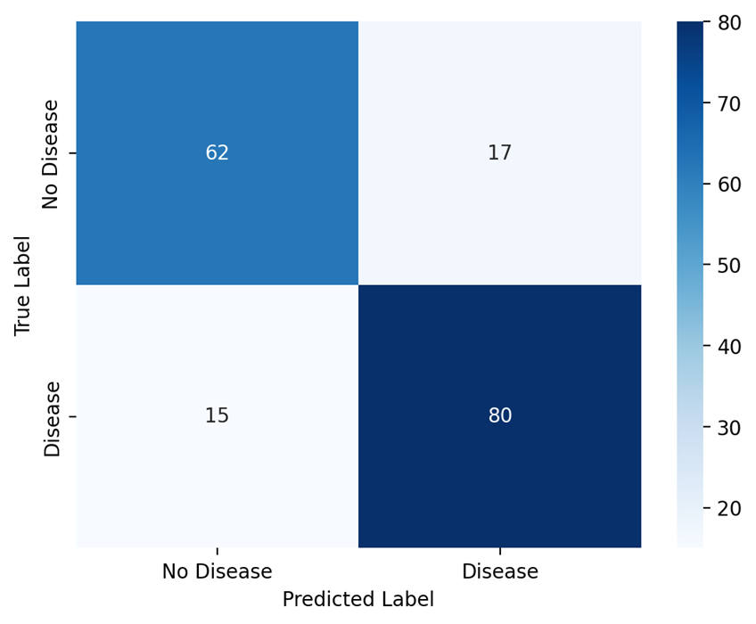
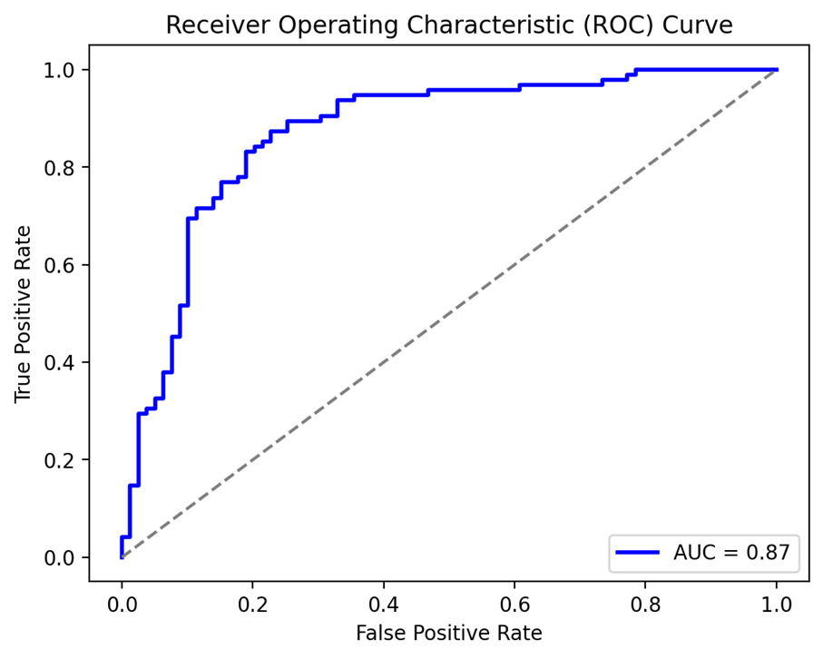

# Heart Disease Prediction with ANN 

##  Project Overview
This project focuses on **hyperparameter tuning** for an **Artificial Neural Network (ANN)** using **Streamlit** to visualize model performance. The model is trained to predict **heart disease risk** (0 = No Disease, 1 = Disease) based on the **Heart Disease UCI dataset**.

##  Project Structure
```
📦 Heart Disease ANN
├── 📜 streamlit.py                     # Main Streamlit dashboard for visualization
├── 📜 filter.py                        # Sidebar filters for hyperparameter tuning
├── 📜 load_and_train_model.py          # Loads data and trains the model
├── 📜 model.py                         # Builds and trains the ANN model
├── 📜 heart_disease_uci.csv            # Dataset used for prediction
└── 📜 README.md                        # Project documentation (this file)
```

##  Dataset Information
We use **`heart_disease_uci.csv`**, which contains various patient health attributes. The model predicts **`num`**:

| Column Name | Description |
|------------|-------------|
| `id` | Patient ID |
| `age` | Age of the patient |
| `sex` | Gender (Male/Female) |
| `dataset` | Dataset source (e.g., Cleveland) |
| `cp` | Chest pain type |
| `trestbps` | Resting blood pressure |
| `chol` | Serum cholesterol level |
| `fbs` | Fasting blood sugar (True/False) |
| `restecg` | Resting electrocardiographic results |
| `thalch` | Maximum heart rate achieved |
| `exang` | Exercise-induced angina (True/False) |
| `oldpeak` | ST depression induced by exercise |
| `slope` | Slope of the peak exercise ST segment |
| `ca` | Number of major vessels colored by fluoroscopy |
| `thal` | Thalassemia result |
| `num` | **Target variable (0 = No Disease, 1 = Disease)** |

## 🔧 Hyperparameters Tuned
The **hyperparameter tuning** is implemented via **Streamlit's sidebar** with the following options:
- **Model Architecture**: Number of layers, neurons per layer, activation functions, dropout rate.
- **Optimization Settings**: Learning rate, optimizer type (Adam, SGD, RMSprop), batch size, epochs.
- **Regularization Techniques**: L1/L2 regularization, DropConnect, Batch Normalization.
- **Gradient Descent Types**: Batch GD, Stochastic GD, Mini-Batch GD.

##  Model Performance Visualization
After training, the Streamlit dashboard provides:
1. **Model Summary** 
2. **Training History Graph** 
3. **Confusion Matrix (Heatmap)** 
4. **Classification Report (Precision, Recall, F1-score)** 
5. **ROC Curve (AUC Score)** 
6. **Training & Testing Time** 

##  How to Run the Project
1. **Install Dependencies:**
    ```sh
    pip install -r requirements.txt
    ```
2. **Run the Streamlit Dashboard:**
    ```sh
    streamlit run streamlit.py
    ```
3. **Interact with the Sidebar** to modify hyperparameters and visualize results.

##  Example Output (Confusion Matrix & ROC Curve)
The dashboard dynamically generates:
- Confusion Matrix:
  
- ROC Curve:
  

##  Future Enhancements
- Improve feature selection and engineering.
- Experiment with different architectures (CNN, RNN, Transformers).
- Deploy the model using **Streamlit Cloud**.

---
Made with ❤ by AI Enthusiasts 
